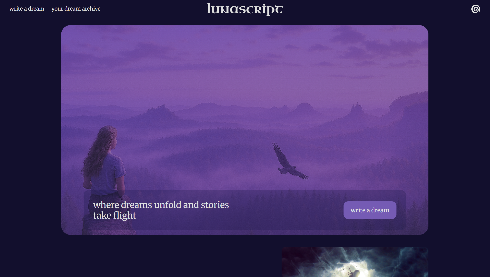
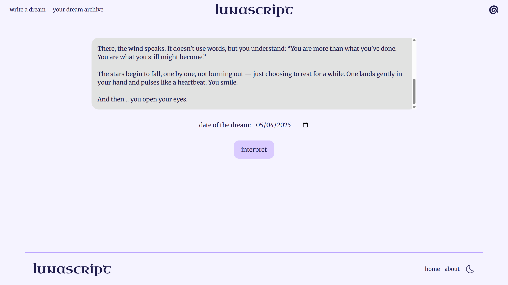
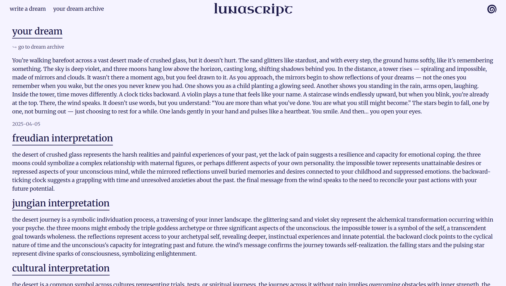
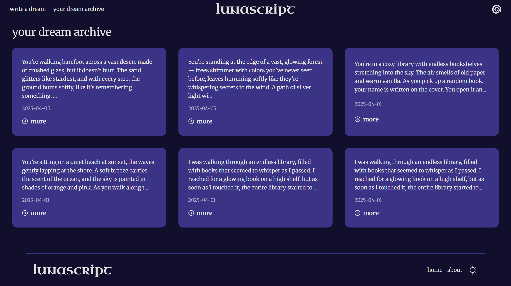

# lunascript






lunascript is a dream interpreter platform that uses AI to help users explore the meanings of their dreams. This project was built as a self-improvement and learning experience — combining modern frontend tools with backend services and AI integration.

## Features

- 🔮 **Dream Interpretation with Gemini API**  
  Users can write down their dreams, and LunaScript uses the Gemini API to generate insightful interpretations.

- 🔐 **Authentication with Firebase**  
  Secure user login via Firebase Authentication.

- ☁️ **Dream Storage**  
  Each user's dreams are saved and retrieved using Firebase Firestore.

- 🌗 **Dark Mode Support**  
  Smooth light/dark mode switching using Zustand for state management.

- ⚛️ **Frontend**  
  Built with React and styled with Tailwind CSS for a responsive, modern UI.

## Tech Stack

| Tech        | Purpose                            |
|-------------|------------------------------------|
| React, Vite | Frontend UI                        |
| Tailwind CSS| Styling                            |
| Gemini API  | Dream interpretation               |
| Firebase    | Authentication & Database          |
| Zustand     | Dark mode state management         |
| React Router| Routing         |

## Installation

1. **Clone the repository:**
   ```bash
   git clone https://github.com/benenesgunes/lunascript.git
   cd lunascript
   ```
2. **Install dependencies:**
   ```bash
   npm install
   ```
3. **Set up environment variables:**
   Create a .env file in the root of the project and add the following:
   ```bash
    VITE_FIREBASE_API_KEY=your_firebase_api_key
    VITE_FIREBASE_AUTH_DOMAIN=your_project.firebaseapp.com
    VITE_FIREBASE_PROJECT_ID=your_project_id
    VITE_FIREBASE_STORAGE_BUCKET=your_project.appspot.com
    VITE_FIREBASE_MESSAGING_SENDER_ID=your_sender_id
    VITE_FIREBASE_APP_ID=your_app_id
    VITE_GEMINI_API_KEY=your_gemini_api_key
   ```
4. **Start the development server:**
  ```bash
  npm run dev
  ```
## License

This project is a nonprofit, solo initiative and is licensed under the MIT License.

## Contributing

As this is a solo project, contributions are not currently being accepted, but feel free to open an issue if you encounter any bugs.

   
